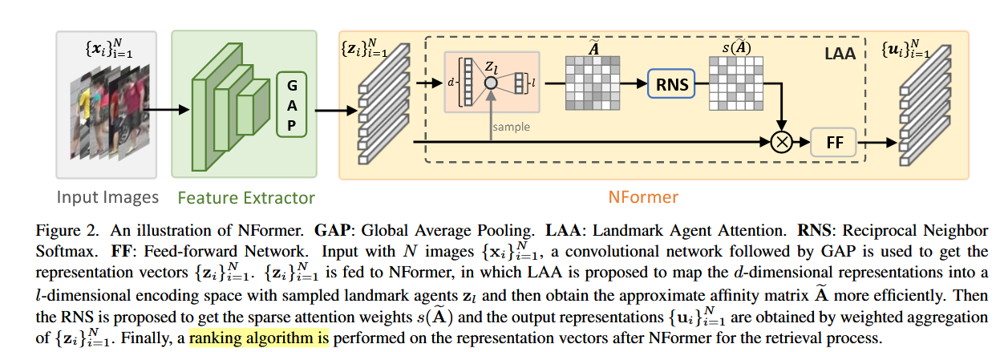
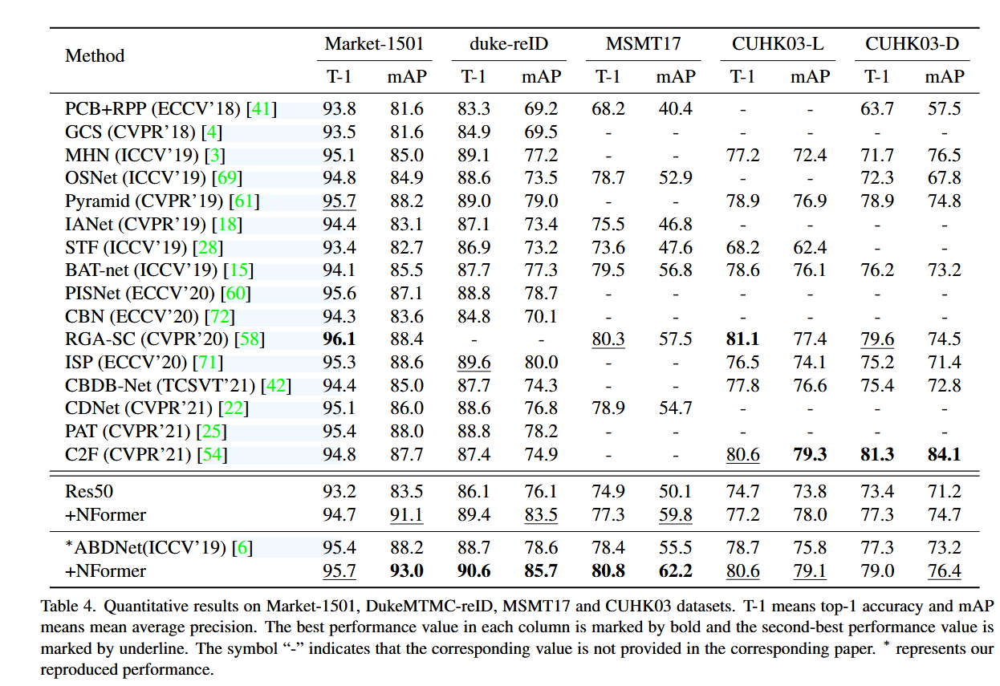
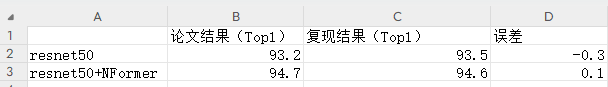
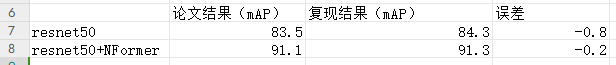

# 一、论文重点总结以及创新点
## 1. 文章解决了什么问题  
本文想解决不同相机对相同人员的识别问题。由于相同人员在不同的相机捕捉下，特征会出现变化，因此需要一个方法判别两张照片是否是同一个人。
## 2. 文章解决这个问题用了什么方法  
本文通过引入两个全新的模块：Landmark Agent Attention模块和Reciprocal Neighbor Softmax。  
具体来讲，Landmark Agent Attention 是在transformer计算k和q时分别乘上一个矩阵，对特征向量进行降维，从而降低计算复杂度。作者通过实验证明了缩放后的向量依旧可以代表图片的特征。  
Reciprocal Neighbor Softmax 这个改进点是，在前面乘上一个mask M，只保留前K大的权重，其余的权重赋值为0，这种方法降低了时间复杂度。  
## 3. 文章的创新点是什么    
本文提出了一个模型，用来解决对大量图像之间的相关性建模问题。  
由于该问题的主要矛盾是计算复杂度问题，本文提出了两个新的模块Neighbor Transformer Network 和 NFormer，来解决计算复杂度问题。并通过消融实验证明，在多个数据集上有较好的表现。  
   

## 1. 模型的结构是什么（包括损失函数，优化器）    

参照图片二来讲，首先输入N张图片，通过一个卷积网络（文中的backbone）进行特征提取，再通过GAP拉成N个向量,通过LAA进行相似性计算，最后通过一个排名算法得到最终结果。  
代码中使用adam优化器，论文中所写的是gsd优化器。  
损失函数是三个损失函数的加权，分别是身份损失（identity loss）（表示分类误差）、中心损失（center loss）（表示某一个样本的特征向量与该类样本的特征向量平均值的误差） 和三元组损失（triplet loss）

## 2. 用到的数据集是什么，结构是什么    
Market1501 , DukeMTMCreID , MSMT17 and CUHK03
数据集包括一个gallary（在文件夹test_boundingbox中）包含很多任务画像，还包含一个训练集和一个查询集。通过训练集和gallary中的数据组成监督学习对照，进行训练。验证时，通过query中的图像查找gallary中的对应数据。此外，数据集中有些图像并不是直接将人框出，而是保留了一定的背景干扰，需要模型自主识别人的位置。
## 3. 前人的工作是什么  
“Feature Representation Learning Methods“通过图像分割、背景去除等方法加强特征提取的效果。  
 “Ranking Optimization Methods” 前人提出了通过自适应检索、相似性聚合、利用上下文信息检索等多种方法优化排名效率。
## 4. 作者做了哪些实验，评价指标是什么  
作者做了原生res50和res50+Nformer的对比实验。  
该任务有两个评价指标，一个是mAP，另一个是topK评价指标。  
mAP 是所有查询图像的平均精度（AP）的均值
Top-k 准确率 衡量的是：对于每个查询图像，模型返回的前k个候选图像中是否包含正确的匹配。
## 5. 模型的训练方法是什么  
模型在训练时的参数，代码和论文中有较大的差异，在训练轮数batchsize等方面均有不同。重点是优化器使用Adam，和论文中不同。  
在代码中，首先将在imageNet上预训练过的resNet作为backbone，并先训练resnet 120轮。之后将resnet冻结，加上NFormer，再训练20轮。
## 6. 实验结果怎么样  
加上NFormer之后，大多数模型有3%到5%的提高。最高有9%左右的提高。  
论文中的实验结果如图所示:


# 二、复现论文的结果  
复现了NFormer在Market1501数据集上的表现。  
结果如下图所示：  

  
实验日志数据和模型权重均在附件中


# NFormer代码精读
NFormer代码用到了Ignite框架，需要在学习Ignite框架的基础上进一步学习。
# model模块解析

## NFormer对Market1501数据集的预处理流程

#### backbone模型的运行流程
```py
## format: [B,C,W,H]
back_bone_input_size: torch.Size([64, 3, 256, 128])
shape_after_backbone: torch.Size([64, 2048, 16, 8])
shape_after_gap: torch.Size([64, 2048, 1, 1])
then, resize the shape to [64,2048]
then, forward to a linear layer, and reshape to [64,256]

then, classify every feature vector, the shape of the finnal result is [64,751]
the vector above is the probility of the identity of people
when training the backbone, we can calculate the loss from the vector of shape[64,751]
when training the NFormer, we should remove the linear layer
```
### NFormer模型的运行流程
```py
# 从backbone中得到的结果是[B,256]
# 在nformer.py中，首先将输入拼接到一起，得到的维度是
[2,7000,256] #（B，B，C）
# 之后送入LAA网络


```
### 从backbone中得到结果后的后处理过程
    
从backbone中得到提取出来的特征之后，需要计算特征之间的欧氏距离，选取欧式距离最小的向量
```py


# 计算欧式距离中的平方项
distmat = torch.pow(qf, 2).sum(dim=1, keepdim=True).expand(m, n) + \
            torch.pow(gf, 2).sum(dim=1, keepdim=True).expand(n, m).t()
# 计算欧式距离中的-2xy项
distmat.addmm_(1, -2, qf, gf.t())  
```

## train 脚本的运行流程
```py
[Experiment-all_tricks-tri_center-market.sh] python3 tools/train.py
[tools/train.py] main() call tools.train.train 

```
