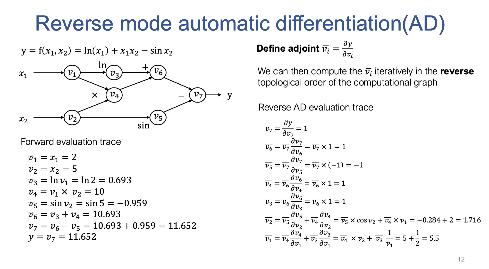

# 第四节：“Manual” Neural Networks
## 1. 导数的计算方法
- **前向差分（Forward Difference）**:
   \[
   f'(x) \approx \frac{f(x+h) - f(x)}{h}
   \]

- **后向差分（Backward Difference）**:
   \[
   f'(x) \approx \frac{f(x) - f(x-h)}{h}
   \]

- **中心差分（Central Difference）**:
   \[
   f'(x) \approx \frac{f(x+h) - f(x-h)}{2h}
   \]
## 2. 前向自动微分和反向自动微分

如上图所示，自动微分首先将函数转换成一个计算图。然后通过链式法则计算每个点的微分。
前向自动微分是从左向右逐个变量计算对于x的微分。
反向自动微分是从右向左逐个变量计算对于y的微分。

