# 一、分布式系统概念与设计
## 1.1 分布式系统的特征
并发、缺乏全局时钟、故障独立性
## 1.5 分布式系统面临的挑战
0. 异构性、开放性、安全性、可伸缩性、故障处理、并发性、透明性、服务质量
1. 基础设施（例如网络、计算机硬件、操作系统、编程语言）存在异构性。
2. 中间件： 为了屏蔽底层设施的异构性，人们提出了中间件。中间件指一个软件层，提供一个抽象的编程。
3. 异构性和移动代码： 移动代码指计算机的代码能从一台计算机直接复制到另一台计算机上运行。虚拟机提供了一种移动代码的方法。

# 二、系统模型
物理模型、体系结构模型、基础模型。  
物理模型：考虑组成计算机的设备和硬件结构。  
体系结构：模型从系统的计算和通信任务来描述系统。
基础模型：采用抽象的观点描述单个问题的解决方案。例如：交互模型、故障模型、安全模型。

# 三、网络和网际互联
分布式系统的连接网络需要考虑的问题：
性能、可伸缩性、可靠性、安全性、移动性、服务质量、组播（一对多通信）

# 四、进程间通信
消息传递接口（Message Passing Interface， MPI）是一个标准，为一组具有同步和异步支持的消息传递操作提供API。
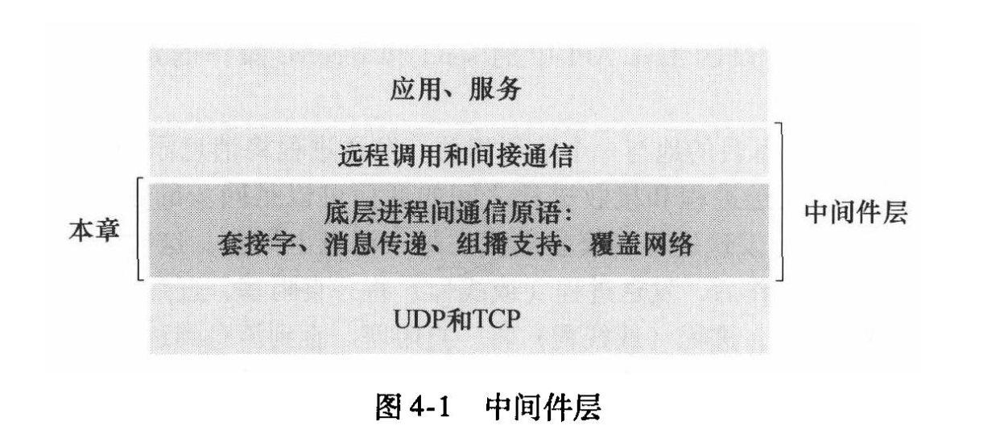
## 同步通信和异步通信
消息传递通过java中的send和receive api进行操作。send是将数据复制到本地的一个消息队列中，receive是从远程的一个消息队列中读取一个信息。
通信分为同步通信和异步通信。在同步通信中，每次执行一个send操作之后，发送进程会一直阻塞，直到数据通过receive从消息队列中发送出去；在异步通信中，每次执行一个send操作之后，发送进程会继续执行别的操作，不会等待数据从消息队列中被读取。
同理，receive也有同步和异步之分。
简而言之，同步通信必须要对方接收了消息才能继续执行，而异步通信只需要放到消息队列里就可以了。

## 套接字
套接字是一个封装的api，可以自动地建立tcp、udp连接，并进行连接的维持。套接字的主要参数包括ip地址和端口号。
## TCP和UDP通信

## 4.3 外部数据表示和编码
不同的系统之间在数据传递的过程中，必须将数据进行编码。
编码的方式包括CORBA公共数据表示、java对象序列化、XML

## 远程对象调用
CORBA和java支持远程对象调用

## 组播通信
组播通信是将信息发送给一组接收者，不同于单播的发给单一接收者，广播的发给所有接收者。

# 五、远程调用
远程调用包括远程过程调用（RPC）和远程方法调用（RMI）。
这两个远程调用之间的区别就类似于面向对象和面向过程之间的区别。

## 5.2 请求应答协议
请求应答协议可以抽象成三个原语：doOperation getRequest sendReply
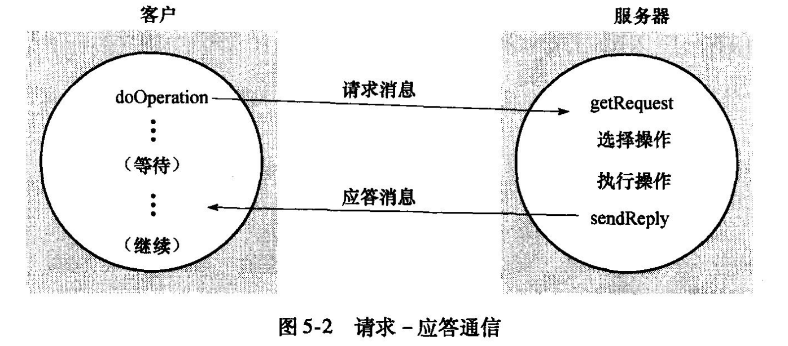
请求应答协议基于上面提到的阻塞的send和receive（后面的间接通信会用到非阻塞的方法）  
- 消息标识符用来对每个消息进行编号，一种方法是使用一个requestId进行标识，另一种方法是使用ip地址+端口号进行标识。

- 请求应答协议的故障模型：通信故障有遗漏和未按照顺序传输。考虑到这些故障，doOperation在获取服务器应答时使用超时（time out）、丢弃重复的请求信息、使用幂等操作防止应答信息丢失产生重复请求。对于需要重新应答但是不需要重新操作的需要记录历史。
- 交互协议的类型：
请求R
请求应答RR
请求应答确认应答RRA

- 请求应答在TCP流中的使用

## 5.3远程过程调用RPC
- 接口编程：接口编程是RPC推动产生的编程风格。接口编程是指为每个模块定义一个显式的接口，模块之间通信只能访问接口提供的方法，隐藏了除接口之外的其他信息。只要接口保持相同，模块就可以随意改变。
- RPC调用的四种语义（书上只写了三种）
或许、至多一次、至少一次、精确一次

- RPC调用的实现
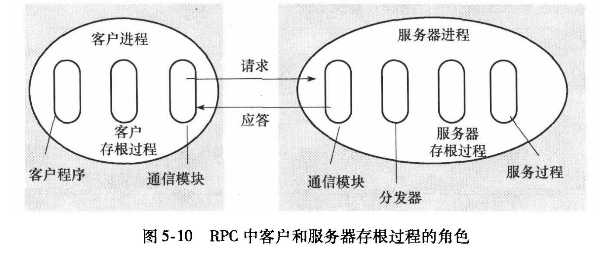
- - 客户端存根（Client Stub）
提供一个与远程方法接口相同的本地方法，调用时将请求序列化并发送到服务器。
- - 服务器存根（Server Stub）
接收来自客户端的请求，反序列化后调用实际的服务方法，并将结果序列化发送回客户端。
网络通信
- - 客户端与服务器之间通过网络传输序列化后的请求和响应数据。
序列化与反序列化
- - 将方法调用的参数和返回值在内存表示与传输格式（如 JSON、XML、Protobuf）之间转换。

## RMI

# 六、间接通信
间接通信可以实现时间解偶和空间解偶。空间解偶是指通信双方不知道对方是谁，时间解偶是指双方不需要同时存在。（注意异步通信和时间解偶有微弱的区别，异步通信是指发送信息之后不需要等待，时间解偶是指发送时甚至不需要存在）。
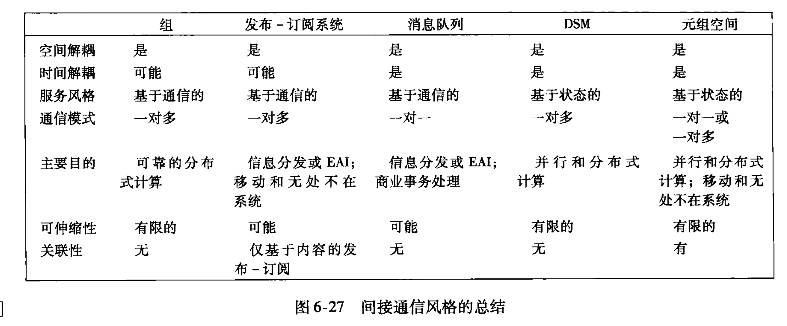

# 七、操作系统支持
- 分布式操作系统：在一个分布式系统上，对多个硬件通过网络进行连接，操作系统提供一个虚拟的映像。
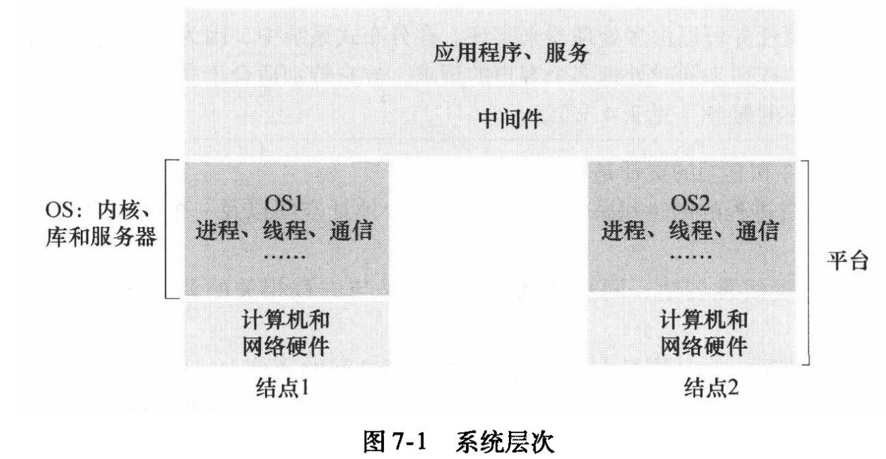

# 八、分布式对象和组件
## 8.1 分布式对象中间件
## CORBA相关省略
## java bean

# 九、web服务
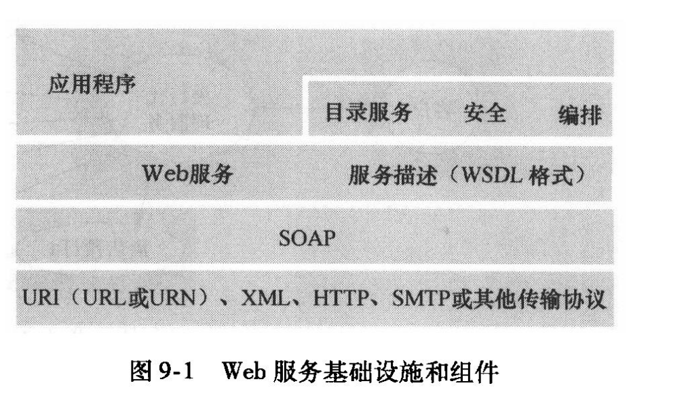
- URI（统一资源标识符）是用来唯一标识资源的字符串，是一个泛化概念；URL（统一资源定位符）是 URI 的子集，不仅标识资源，还提供访问资源的方式（如协议和地址）；URN（统一资源名称）也是 URI 的子集，仅用于标识资源的名称，而不涉及资源的定位或访问。简单来说，URL 关心“资源在哪里”，URN 关心“资源是什么”，而 URI 包含两者。
## 9.1 web服务
web服务中，信息的标识有soap和rest两种方式
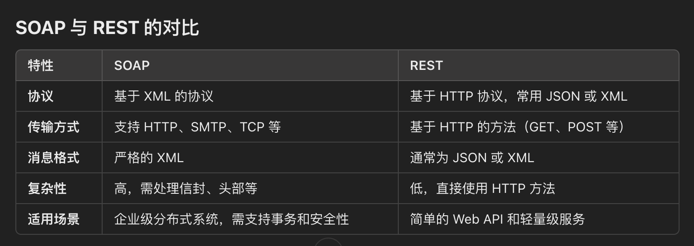

## 9.4 web服务使用的目录服务

## 9.5 XML安全性

# 十、对等系统
对等系统具有以下特点：每个用户都能向系统提供资源、每个成员有相同的功能和责任、不依赖中心管理系统、成员有一定的匿名性。

文件可以使用一个散列码来验证正确性，防止恶意篡改，但是这是在静态文件的前提下。

# 十一、安全性
## 1.简介
- 安全威胁分为三类：泄漏、篡改、蓄意破坏
- 窃听、伪装、消息篡改
- 重发、拒绝服务

# 十二、分布式文件系统

# 十三、名字服务
本章包含全局名字服务(GNS)和X.500目录服务
- 名字一般被绑定到对象的属性上，而不是对象的实现上。

# 十四、时间和全局状态
## 14.2 时钟、事件和进程状态
- 时钟偏移（clock skew）是指两个时钟在某个时刻读数的差异。
- 时钟漂移（clock shift）是指两个时钟射频不同，经过一段时间之后读数不同。
- 通用协调时间（UTC）时间基准，是通过原子钟得到的准确时间。
## 14.3 同步物理时钟
- 同步系统中的简单同步：
对于一个分布式系统，传输时间最大为max，最小为min，那么时钟偏移的最大值为u=max-min
同步时钟时，补偿的时间设置为u/2
对于N个时钟的系统，时钟偏移的最优范围是u(1-1/N)
- 客户端发送请求到时间服务器，记录发送时间T1。时间服务器收到请求后，返回当前时间Ts。客户端接收服务器时间，记录接收时间T2。
计算时间偏移为：
Offset=Ts+(T2-T1)/2
这种方法对基准时钟的依赖较高

- Berkeley算法
这种算法适用于没有可靠时间源的系统。
一个节点（主节点）收集所有节点的时间，包括自身。
主节点计算时间的平均值，并将时间调整值分发给所有节点。
各节点根据调整值更新自己的时钟。

## 14.4逻辑时钟
- 逻辑时钟只关注事件之间的因果关系，而不关注具体的物理时间。
每个节点维护一个逻辑时钟，初始值为 0。
当节点发生事件时，逻辑时钟加 1。
当节点发送消息时，将自己的逻辑时钟值附加到消息中。
当节点接收到消息时：
更新本地逻辑时钟为：
T_local=max(T_local,T_remote)+1
上述方法称为Lamtorp方法
- 每个事件的时间戳由两个部分组成：(L,ID)
如果L1 < L2，则事件 1 发生在事件 2 之前。
如果L1=L2，则通过比较节点 ID（字典序）来决定顺序。

- 向量时钟
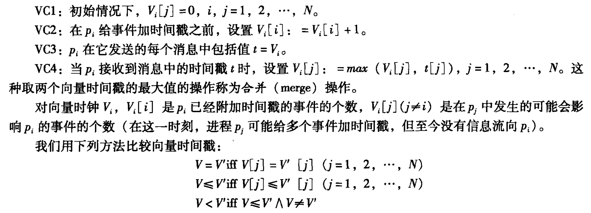

## 14.5全局状态

## 选举算法
- 欺负算法 - Bully Algorithm
当某个节点检测到领导节点失效时，它会发起选举。
发起选举的节点向优先级高于自己的所有节点发送“选举消息”。
如果接收到消息的节点发现自己优先级更高，会回复该节点并自己发起选举。
选举过程持续，直到只剩下优先级最高的节点未被“欺负”。
优先级最高的节点会通知所有其他节点，宣布自己为新领导。

- 环算法 - Election in a Ring
当一个节点检测到领导节点失效时，它开始一个“选举环”。
发起选举的节点将包含自己标识（如优先级）的消息沿着环传递。
每个节点收到消息后，比较消息中的优先级与自己的优先级：
如果优先级较低，继续传递消息；
如果优先级较高，用自己的标识替换消息中的标识后继续传递。
当消息最终回到发起节点时，发起节点会宣布优先级最高的节点为新领导。
新领导会广播自己成为领导的消息。

- 无线系统下的选举算法
基于能量的选举算法：
每个节点向邻居广播自身的剩余能量。
邻居节点对比所有接收到的能量值，选择能量最高的节点作为候选。
候选节点广播自己成为新领导。
基于信号强度的算法：
每个节点测量与邻居节点的信号强度。
信号强度最高的节点作为领导，以确保通信稳定。
基于分簇的选举：
网络划分为多个簇，每个簇内选举出一个簇头（Cluster Head）。
簇头通常基于节点的剩余能量或连通性选出，并负责簇内的通信和协调。

# 十五、协调与协定
## 分布式互斥

## 拜占庭将军问题
高可靠的分布式系统中需要有较高的容错能力，包括处理其中一部分组件和其他组件返回的消息互相冲突的场景。这个问题可以类比于拜占庭军队围攻一个城池时，各个将军间只能通过信使通信，而将军中可能会有叛徒传递错误的消息。因此需要一种算法能够保证忠诚的将军可以互相达成一致。

假设拜占庭将军们在敌军的周围，将军之间的通信只能通过信使，每个将军根据自己观察的敌情确定下一步的军事行动。将军中可能有背叛者来阻止忠诚的将军达成一致。为了保证下一步军事行动的一致性，将军们需要

忠诚的将军最终的决定是一致的。（背叛者可以按照自己的意愿做决定）
少数的背叛者不能导致忠诚的将军做出错误的决定。
分布式系统中，没有服务器的存在，所以只能每个节点各自做决定。现在已知网络通讯是可靠的，但是存在不可靠的节点（叛徒）。

需要找到一个算法，每个服务器都使用这个算法来做决策，有叛徒存在的情况下（因为有的节点会出错），至少需要多少个节点，可以做到：

所有正常的结点，做出的决定是一致的；
出错的节点不会影响到正常的节点做决定。

- 投票 - Voting
总结点数为n，其中有m个结点出错。
投票需要少数服从多数，n-m>m,所以当𝑛≥2𝑚+1时，能满足要求。
- 口头消息 - Oral Message
当𝑛≥3𝑚+1时，能满足要求。
- 带签名的消息 - Sign Message
当𝑛≥𝑚+2时，能满足要求。

# 十六、事务与并发控制

# 十七、分布式事务

# 十八、复制
## 以数据为中心的一致性
- 定义：
以数据为中心的一致性模型描述了分布式系统在多个副本之间如何保持数据一致性。这种模型关注所有副本的数据状态，从系统的全局角度定义一致性语义。
- 常见模型：
- - 强一致性 (Strong Consistency)：
系统保证每次操作都立即可见，所有副本始终同步更新。即，每次读取数据都能获取最新值。
通常通过分布式事务或同步机制实现，如两阶段提交 (2PC)。
适用于需要高准确性的场景，但延迟较高。
- - 线性一致性 (Linearizability)：
每个操作看起来都是在一个全局的时间序列中执行的，符合实际物理时间顺序。
强一致性的具体形式，提供更严格的时间语义。
- - 顺序一致性 (Sequential Consistency)：
所有操作按其提交顺序排列，但不需要符合实际物理时间。
允许稍松散的时间约束。
（对于单个被操作的结点，在程序中先做的操作必须先执行，后做的操作必须后执行。对于不同的观察结点，他们观察到的必须是相同的。）
- - 弱一致性 (Weak Consistency)：
系统不保证操作的立即可见性，数据可能有延迟。
通常用于高性能、低延迟场景，如缓存系统。

- - 最终一致性 (Eventual Consistency)：
数据副本在一定时间后会趋于一致，但读取数据时可能看到旧数据。
适用于对实时一致性要求较低的场景，如 DNS 系统。
## 以客户为中心的一致性模型
- 定义：
以客户为中心的一致性模型从用户感知的视角出发，关注如何为用户提供一致的体验，而不是系统整体的状态一致性。它描述的是用户在访问分布式系统时的感知一致性。
- 常见模型：
- - 单一用户的单调读一致性 (Monotonic Reads)：
用户不会读取到比之前更旧的数据。
例如：某用户刚看到的值是 5，下次读取时不会返回比 5 更旧的值。
- - 单一用户的单调写一致性 (Monotonic Writes)：
用户的写操作按其提交顺序被系统执行，不会出现颠倒的顺序。
例如：用户先写入 A，后写入 B，则系统不会出现先写入 B 再写入 A 的情况。
- - 读写一致性（Read Your Writes Consistency）
读写一致性要求用户能够读取到自己最近写入的数据，而不需要等待其他节点同步。
- - 写读一致性 writes-follow-reads
在x上所有接下来的写操作，应该是从上次读到的地方开始写，或者是比上次读到的结果还要新的地方开始写。
- - 会话一致性 (Session Consistency)：
在同一会话内，用户始终看到一致的数据。
例如：用户登录时看到的状态不会因不同的操作会话而不一致。
- - 因果一致性 (Causal Consistency)：
如果一个操作因另一个操作而发生（即存在因果关系），系统会确保它们按因果顺序可见。
例如：一个用户的写操作 A 导致了另一个写操作 B，其他用户必须按 A → B 的顺序看到这些操作。
- - 最终一致性 (Eventual Consistency)：
适用于对实时性要求较低的场景，用户可能暂时看到不一致的数据，但最终会达到一致状态。
- 比较
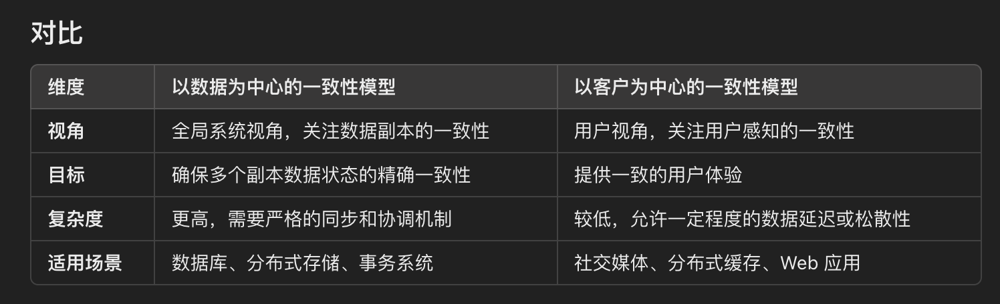 
## paxos协议
Paxos协议的运行步骤
Paxos协议通常分为两个阶段：
1. 第一阶段（Prepare 阶段）：提议者发起准备请求
提议者选择一个唯一的提案编号 N 并发送 准备请求（Prepare Request） 给所有接受者。
接受者接收到请求后：
如果 N 大于它已经承诺的任何编号，它将承诺不再接受编号小于 N 的提案，并回复提议者已经接受的最高编号的提案值。
如果 N 小于或等于之前的承诺编号，则忽略该请求。
2. 第二阶段（Accept 阶段）：提议者发送接受请求
如果提议者从大多数接受者处接收到准备请求的响应：
它将选择一个值V作为提案值。
如果响应中包含某个已被接受的提案值，则选择编号最高的提案值。
如果没有任何已被接受的值，则可以选择自己提出的值。
它向所有接受者发送 接受请求（Accept Request），包括编号N和提案值V。
接受者接收到接受请求后：
如果编号N大于或等于其当前承诺的编号，则接受提案值V，并将其保存为已接受的值。
否则，忽略该请求。
学习阶段（Learn 阶段）：
一旦提案值V 被大多数接受者接受，协议的决策就完成。
学习者从接受者获取该决策值，或通过一个额外的协调者广播最终结果。

# 十九、移动和无处不在计算

# 二十、分布式多媒体系统

# 二十一、Google分布式系统设计
## google云计算平台的架构
文件存储：Google Distributed File System，GFS
并行数据处理：MapReduce
分布式锁：Chubby（Chubby是分布式锁，不是文件系统）
结构化数据表：BigTable

## GFS
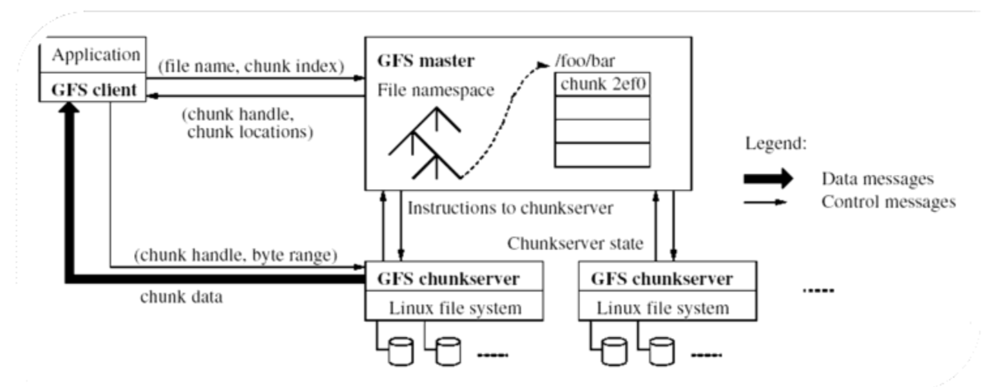
- GFS架构：
GFS的架构由三种主要组件构成：
- - GFS Master（主节点）：
负责存储文件的元数据，包括文件名、目录结构（文件命名空间）、数据块（chunk）的位置信息以及每个数据块的副本信息。
管理chunk（数据块）的分配，协调chunkserver之间的数据复制。
与客户端和chunkserver通信，以实现元数据操作。
- - GFS Chunkserver（数据块服务器）：
存储实际的数据块，每个块固定大小（通常为64 MB）。
数据块存储在本地Linux文件系统中，通过唯一的chunk handle（块句柄）标识。
每个块有多个副本，分布在不同的chunkserver上以提高容错能力。
- - FS Client（客户端）：
客户端是应用程序与GFS交互的接口。
它与Master节点通信以获取文件的元数据，同时直接与chunkserver交互以读取或写入数据。

- GFS的工作流程：
- - 元数据请求：
客户端发送包含文件名和数据块索引的信息请求到GFS Master。
Master返回数据块句柄（chunk handle）以及对应数据块在chunkserver上的位置信息（chunk locations）。
- - 数据操作：
客户端通过获得的chunk handle和位置信息，直接与相应的chunkserver交互。
例如，读取数据时，客户端会向存储目标块的chunkserver发送请求，从chunkserver中获取所需的字节范围数据。
- - 副本管理：
Master负责维持每个数据块的多个副本（默认3份），监控chunkserver的状态。
当某个chunkserver失效时，Master会指示其他服务器重新复制丢失的数据块。
- - 数据流控制：
数据消息（chunk data）直接在客户端与chunkserver之间传输。
控制消息（如元数据信息）由客户端与Master之间传递。
- 设计特点：
- - 高扩展性：
支持分布式存储，能够处理大规模数据和高并发访问。
元数据操作集中在Master，而数据操作由客户端与chunkserver直接完成，减少了Master的负载。
- - 容错性：
数据块具有多个副本，副本分布在不同的物理节点上，即使部分服务器宕机也能保证数据可用性。
Master监控chunkserver的健康状态，并自动触发数据恢复。
- - 优化性能：
将大文件划分为固定大小的chunk，便于并行处理。
客户端直接访问chunkserver，绕过Master的瓶颈。
- - 松耦合架构：
Master仅负责元数据管理，数据存储和传输由chunkserver处理，提升了系统的整体吞吐量。
## mapreduce
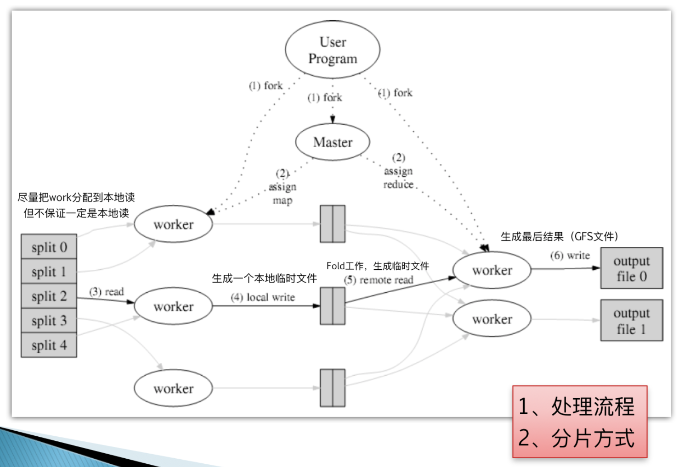
MapReduce工作流程：
- 用户程序（User Program）启动：
用户程序通过调用MapReduce库启动任务，创建多个并行的任务。
通过fork机制，启动一个Master进程和若干Worker进程。
- 任务分配（Task Assignment）：
Master节点负责将任务分配给Worker节点。
任务分为两类：Map任务和Reduce任务。
Master会将输入文件切分成多个split（如图中的split 0, split 1等），然后将每个split分配给一个Map Worker。
- Map阶段：
每个Map Worker从本地或远程读取分配到的split（尽量分配到本地以提高效率，但不保证一定是本地读取）。
Map Worker对读取的数据执行用户定义的Map函数，将数据处理后生成中间结果。
中间结果以临时文件形式写入本地磁盘。
- Shuffle阶段（数据重组）：
Master节点根据中间结果的键值，将数据分组并分配给相应的Reduce Worker。
如果数据不在本地，则需要通过远程读取（remote read）获取。
- Reduce阶段：
Reduce Worker从本地或远程获取分配的数据分组。
每个分组的数据通过用户定义的Reduce函数处理，生成最终结果。
最终结果以输出文件的形式写入分布式文件系统（如图中的output file 0, output file 1）。
- 任务完成：
当所有的Map和Reduce任务完成后，Master节点通知用户程序结果已生成。
最终结果存储在分布式文件系统中，用户可以通过GFS等文件系统进行访问。
- 数据分片方式：
输入数据被分为多个split，每个split是一个独立的数据分片。
分片可以是文件中的固定大小块，也可以根据逻辑分组划分。
通过尽量将任务分配到存储分片的本地节点，减少远程数据传输。
- 特点：
容错性： 如果某个Worker失败，Master会将任务重新分配给其他Worker。
并行性： 多个Worker节点同时执行，提高任务处理效率。
分布式存储： 中间文件和最终结果存储在分布式文件系统中。

## chubby
- 粗粒度是一个什么概念？
两者的差异在于持有锁的时间。细粒度的锁持有时间很短，常常只有几秒甚至更少，而粗粒度的锁持有的时间可长达几天，选择粗粒度的锁可以减少频繁换锁带来的系统开销。
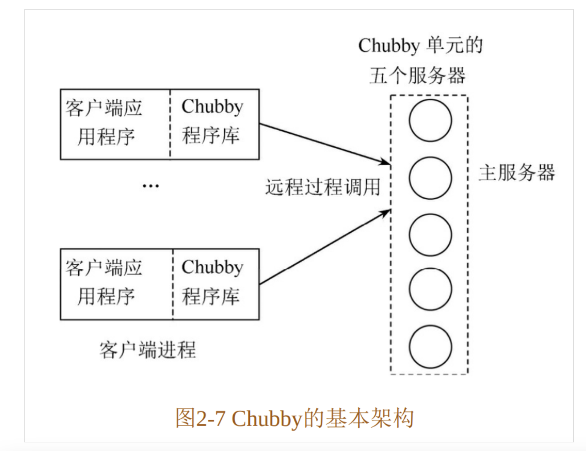
- Chubby的核心架构
客户端（Client）：
客户端通过 Chubby程序库 与 Chubby 服务交互。
客户端应用程序（如分布式存储系统或其他分布式服务）依赖 Chubby 来协调访问共享资源或元数据。
Chubby单元（Chubby Cell）：
一个 Chubby 单元由 五个服务器节点 组成，形成一个分布式服务的基本单元。
主服务器（Master Server）：
在五个服务器中，选举出一个主服务器（Leader），负责处理客户端的所有请求。
主服务器在系统中起到协调作用，管理锁和数据更新。
其他服务器（Follower Servers）：
其余的服务器作为备份，参与一致性协议，确保高可用性和容错性。
一致性协议：
Chubby 使用基于 Paxos 的一致性协议，确保分布式环境下的高一致性。
只要大多数（即 3/5）服务器正常运行，系统可以继续提供服务。
2. Chubby的运行原理
客户端请求：
客户端应用程序通过远程过程调用（RPC）与 Chubby 单元交互。
请求由客户端发往 Chubby 单元的主服务器。
主服务器处理：
主服务器接收客户端请求，并在必要时将请求内容广播到其他从服务器。
主服务器维护锁的状态、文件内容和其他元数据。
一致性保证：
通过 Paxos 协议，确保主服务器的任何更新（如锁分配或文件写入）都被多数服务器确认后才生效。
如果主服务器发生故障，系统通过选举机制在其余服务器中选出新的主服务器，继续提供服务。
数据存储：
Chubby 使用分布式文件系统的形式存储数据，允许客户端创建、读取、更新和删除文件或目录。
文件主要用于存储小规模的元数据，例如配置信息、服务发现等。
锁服务：
Chubby 提供了分布式锁功能，用于协调多个客户端对共享资源的访问。
锁的使用场景包括：防止数据竞争、选主、控制任务调度等。
客户端缓存：
为提高性能，Chubby 允许客户端缓存文件或锁的状态。
当缓存内容变更时，主服务器通过通知机制（如回调）告知客户端更新。
## 
