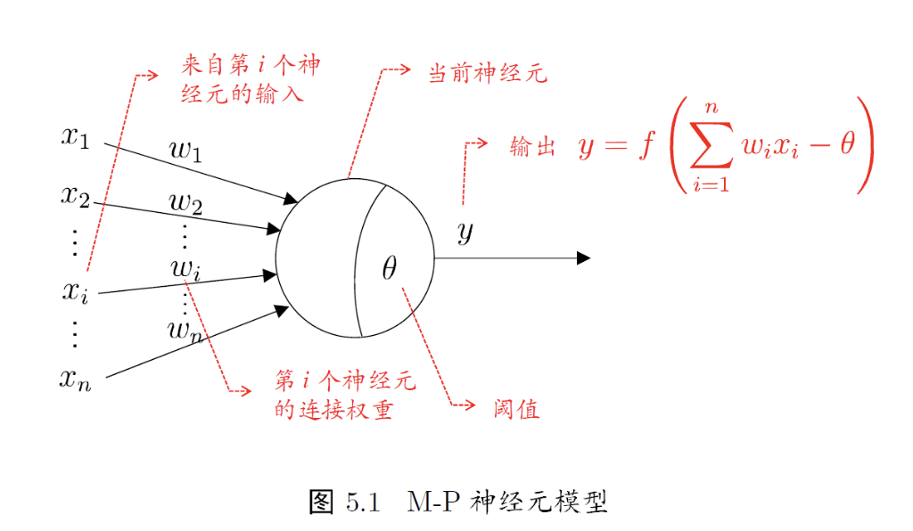
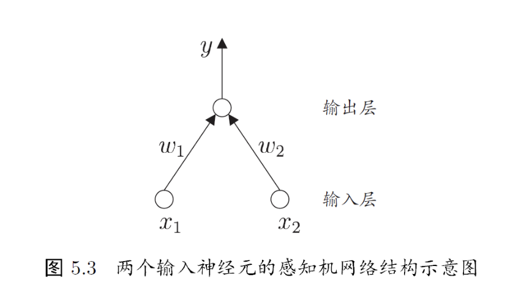
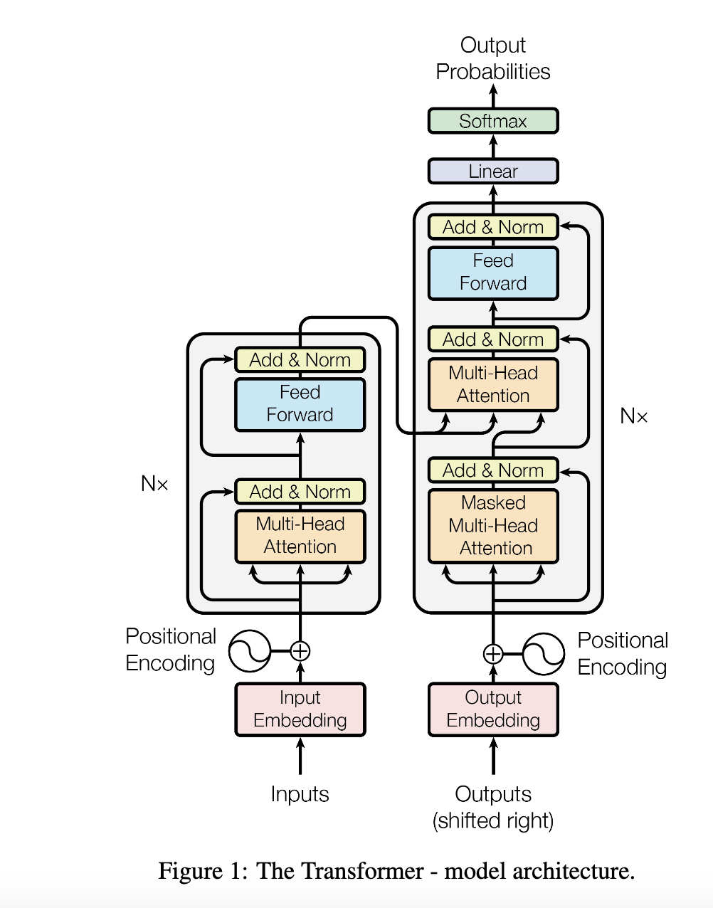
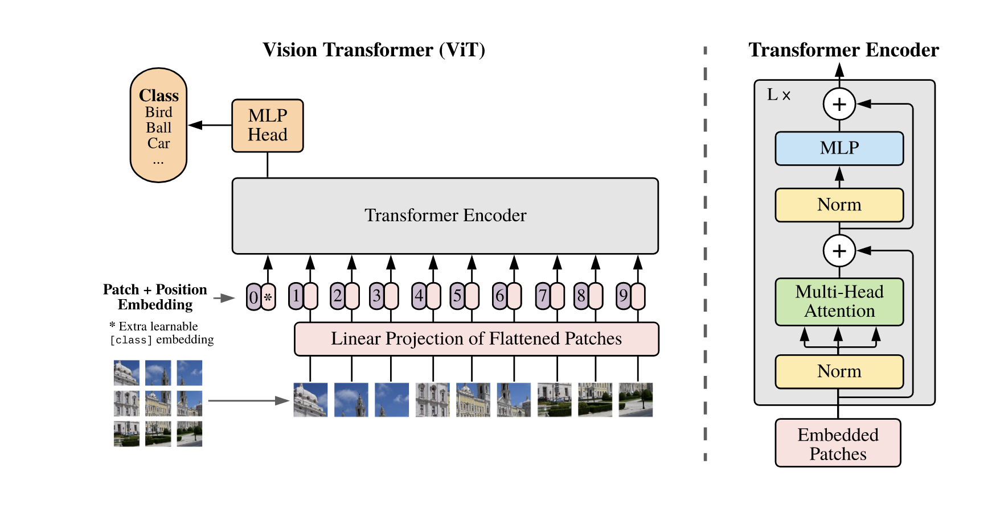
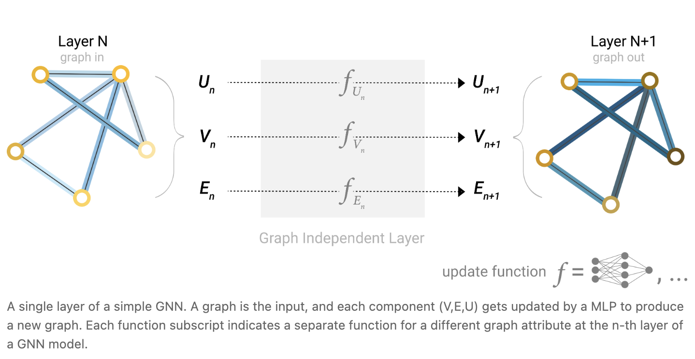
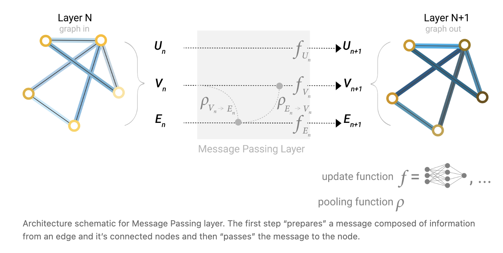
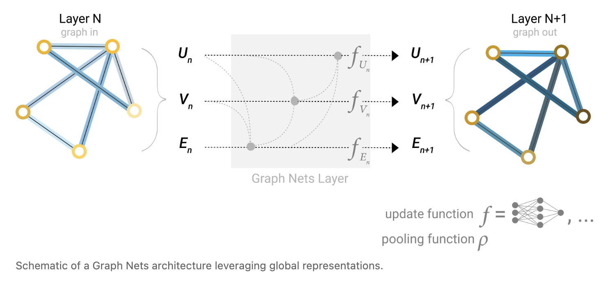

# 神经网络基础
## MP神经元模型
MP神经元模型包括三个部分，分别是输入、处理和输出。
- 输入是接收其他神经元传来的信息
- 处理是将神经元的输入和权重相乘
- 输出是将处理后的结果通过激活函数，得到输出


## 激活函数
初始的激活函数是阶跃函数，这种函数由于不连续，在反向传播中无法求导，现在已经被淘汰。
常见的激活函数有三种，分别是  
sigmoid，relu，tanh

## 感知机


- y = f(w1x1 + w2x2 − θ)
- 感知机的学习：
感知机的可学习参数包括权重W和输出的阈值θ

- 多层感知机
多层感知机在输入层和输出层之间加入了多个隐藏层。

## 反向传播算法


# 卷积神经网络
## 卷基层
- 填充
- 步幅
步幅指每次卷积操作后，卷积核移动的距离
- 感受野
指一次卷积操作可以提取到的图像特征的范围（像素点的个数）
- 多通道卷基层

- 共享卷积核的参数
多个卷积核使用相同的参数，这可以提高训练效率。
## 池化层
池化层就是对图像进行下采样。池化层包括最大池化和平均池化等。

# 经典的卷积神经网络
## AlexNet
- AlexNet通过使用深的卷积神经网络，在图像分类比赛中取得了非常好的成绩。
- AlexNet提出了relu函数，取代了传统的sigmoid函数。
- 

## VGGNet
- 使用小尺寸卷积核(3×3)替代大尺寸卷积核

## GoogleNet

## ResNet
- ResNet解决了梯度消失的问题

## DenseNet
- DenseNet提出了跳跃连接，就是将多层神经网络的每一层的输出都传递到最后，然后在最后一层将所有的特征都聚合起来。
## 迁移学习
- 迁移学习是指，先在源数据集上进行预训练，然后在特定的数据集上进行微调。
- 在微调时，backbone不需要重新训练，但是输出层（head）需要重新进行训练。

# 目标检测任务

## 传统的目标检测方法

## OverFeat模型

## RCNN

## SPP-Net

## Fast RCNN

## YOLO

## SSD


# 图像分割

## FCN

## SegNet

## Mask RCNN

## U-Nets

## PSPNet

## transformer VIT

# 序列数据处理与自然语言处理

## RNN
RNN是处理序列数据的基本网络  
代码如下：
```py
class SimpleRNN:
    def __init__(self, hidden_size, input_size):
        self.Whh = np.random.randn(hidden_size, hidden_size)  # 隐藏层到隐藏层的权重
        self.Wxh = np.random.randn(hidden_size, input_size)   # 输入到隐藏层的权重
        self.bh = np.zeros((hidden_size, 1))                  # 隐藏层偏置
        
    def forward(self, x, h_prev):
        # x: 当前输入
        # h_prev: 上一时刻的隐藏状态
        h_next = np.tanh(np.dot(self.Whh, h_prev) + np.dot(self.Wxh, x) + self.bh)
        return h_next
```
- RNN每个时刻的输出等于 当前输入+上一个时刻的输出。并乘上一个可学习的参数，并加上一个可以学习的偏置值。
- RNN的短记忆和梯度消失问题：对于一个长度为L的序列，如果将其放入到RNN中，RNN的每一个神经元都需要计算L个token，生成的计算图深度大致为L。对于长度较大的序列，会导致计算图过深进而梯度消失。梯度消失问题会使得RNN不能建立起长距离的依赖关系，这就是RNN的短记忆问题。

## 长短时记忆网络（LSTM）
```py
import numpy as np

class LSTM:
    def __init__(self, input_size, hidden_size):
        # 初始化权重矩阵
        self.Wf = np.random.randn(hidden_size, hidden_size + input_size)  # 遗忘门权重
        self.Wi = np.random.randn(hidden_size, hidden_size + input_size)  # 输入门权重
        self.Wc = np.random.randn(hidden_size, hidden_size + input_size)  # 候选状态权重
        self.Wo = np.random.randn(hidden_size, hidden_size + input_size)  # 输出门权重
        
        # 初始化偏置项
        self.bf = np.zeros((hidden_size, 1))
        self.bi = np.zeros((hidden_size, 1))
        self.bc = np.zeros((hidden_size, 1))
        self.bo = np.zeros((hidden_size, 1))
    
    def forward(self, x, h_prev, c_prev):
        # 连接输入和前一个隐藏状态
        combined = np.vstack((h_prev, x))
        
        # 1. 遗忘门
        f = self.sigmoid(np.dot(self.Wf, combined) + self.bf)
        
        # 2. 输入门
        i = self.sigmoid(np.dot(self.Wi, combined) + self.bi)
        
        # 3. 候选状态
        c_tilde = np.tanh(np.dot(self.Wc, combined) + self.bc)
        
        # 4. 更新记忆单元
        c_next = f * c_prev + i * c_tilde
        
        # 5. 输出门
        o = self.sigmoid(np.dot(self.Wo, combined) + self.bo)
        
        # 6. 计算新的隐藏状态
        h_next = o * np.tanh(c_next)
        
        return h_next, c_next
    
    @staticmethod
    def sigmoid(x):
        return 1 / (1 + np.exp(-x))
```
LSTM的思想是将序列分为两支，一支是关键记忆，另一支是临时记忆。

1. 当一个新的token到来时，首先将其拼接到短期记忆h上，得到合并结果combine  
2. 之后将combine放入到forget layer中，得到需要忘记的下标  
3. 之后将combine放入到candidate layer中，得到需要放入到长期记忆中的下标
4. 之后将合并之后的combine通过神经网络得到input向量（由于前面是token拼接到上面的，所以需要经过神经网络）
5. 将以前的c乘上f，进行遗忘，将input乘上新的candidate得到加入的信息
6. 将combine送入forget layer得到输出向量

## Seq2Seq结构
- Seq2Seq结构一般用于自然语言的翻译
- Seq2Seq结构包含编码器和解码器。在训练阶段，使用teaching force方法，就是从编码器输入需要翻译的语言，同时，从解码器输入翻译完成的语言，通过计算误差并反向传播，达到训练的目的。
- 在推理阶段，直接输入要翻译的语言即可。

## TCN
TCN是专门用来处理时序数据的模型。
- 因果卷积：因果卷积本质上就是把输出对齐到卷积窗口的最后一个位置，这样每个时刻的输出只依赖于当前和过去的输入。
- 空洞卷积
空洞卷积就是在感受野内做分散的卷积

## Transformer

transformer是上述的编码器解码器结构
- 注意力机制
注意力机制的公式如下
$Attention(Q,K,V) = softmax(\frac{QK^T}{\sqrt{d_k}})V$
KQ相乘可以计算出一个相似度矩阵（注意力权重），表示每个向量和其他向量的相似度。如果将V乘上这个矩阵，就会给V的不同部分赋予不同的权重，从而实现注意力机制。
softmax是为了将权重归一化成得分
dk是k向量的维度（qk的维度是相同的）。除以dk是为了防止QK矩阵方差过大的情况发生。
- 基于teaching force的训练
在训练时，右侧会输入一个真实值ground truth，在训练时，来进行监督学习。右侧的第一个attention块上有一个mask，在进行监督学习时，模型逐个推理出token，mask会将后面的token遮盖，只留下前面的token来进行监督学习。
- decoder中的两个attention块
第一个attention是自注意力（self attention），第二个attention是crosss attention，是将decoder的查询(query)与encoder的输出(key,value)进行attention计算。
## vision transformer

# 自然语言处理
## 分词
分词包括三种方法，分别是
- 基于字典的分词方法
- 基于理解的分词方法
- 基于统计的分词方法

## 词性标注

## 依存结构

## 文本的向量化表达
- 独热编码
- 词袋模型

## TF-IDF
字词的重要性和词的出现频率一般正相关
- TF:词频
一般词频高的词有更高的重要性
- IDF:逆向文本频率
一个词如果在所有的文档中都出现，则这个词含有的信息量较少
- TF-IDF=TF*IDF


# 图神经网络
- 图神经网络是一类专门处理图结构数据的深度学习模型。
- 图神经网络主要有两种处理方式，分别是空间方法和谱方法。
- 图由节点和边构成。在实际任务中，有的任务需要学习和预测节点，这类任务称为节点级任务。有的任务需要学习和预测边，这些任务称为边缘级任务。
## 空间方法

- 最简单的GNN中，有多层的神经网络，每层神经网络的结构如上图所示。
将图的边E和节点V提取出来，然后通过一个变换函数f，得到下一层的结果。这种方法不会改变图的结构。
- 空间方法的pooling
如果我们想要得到一个预测值，必须将整个图网络映射到一个标量上去。  
类似于CNN的pooling，对于节点上的信息，GNN的pooling是将相邻节点和当前节点的信息求和，之后取平均值（avg pooling）。相似地，也有最大值pooling。
对于边的pooling，是将所有相邻边的特征向量加和，然后进行pooling。
- 在简单的GNN网络中，不能建模节点和节点之间的交互关系，也不能建模出节点和边的交互关系。
- 为了建立节点和边之间的交互关系，我们将节点的特征和边的特征进行交互。

- 为了提取出全局特征，我们可以专门设置一个全局特征向量，来与节点和边进行交互。如下图所示，网络通过映射将节点的特征和边的特征汇聚到全局特征U上。



## 谱方法
谱方法的流程：
构建拉普拉斯矩阵、拉普拉斯矩阵谱分解、傅立叶变换、图上的傅立叶变换、图卷积公式

# 生成对抗神经网络


# 强化学习

- 强化学习是通过分亏不断与环境交互的学习。强化学习没有label，但是要每一步行动环境给予反馈，即奖励or惩罚。

- 强化学习框架的基本构成：Agent（智能体），environment（环境），state（状态），action（行动），reward（奖励）。其中，reward可以是奖励，也可以是惩罚。

## 强化学习的流程图
```
Agent ──────> Action ──────> Environment
  ↑                              │
  │                              │
  └──────── Reward ◄─── State ───┘
```

