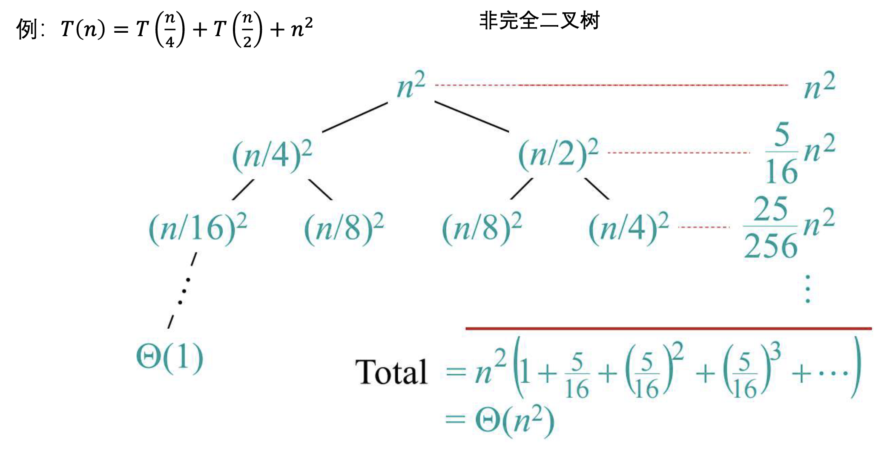
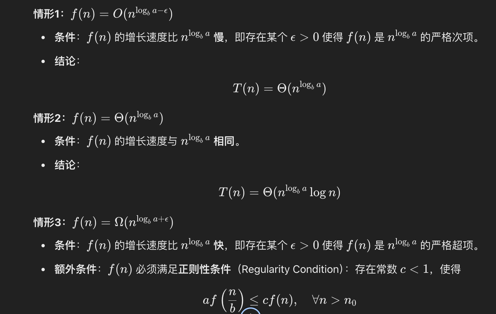
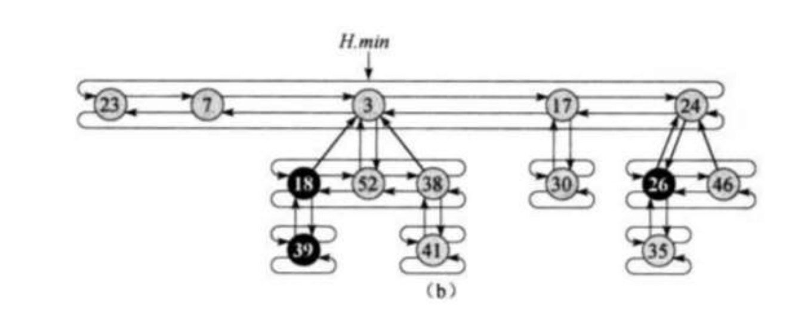
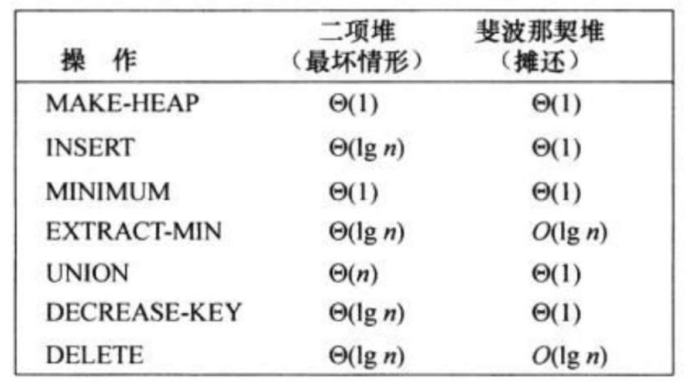
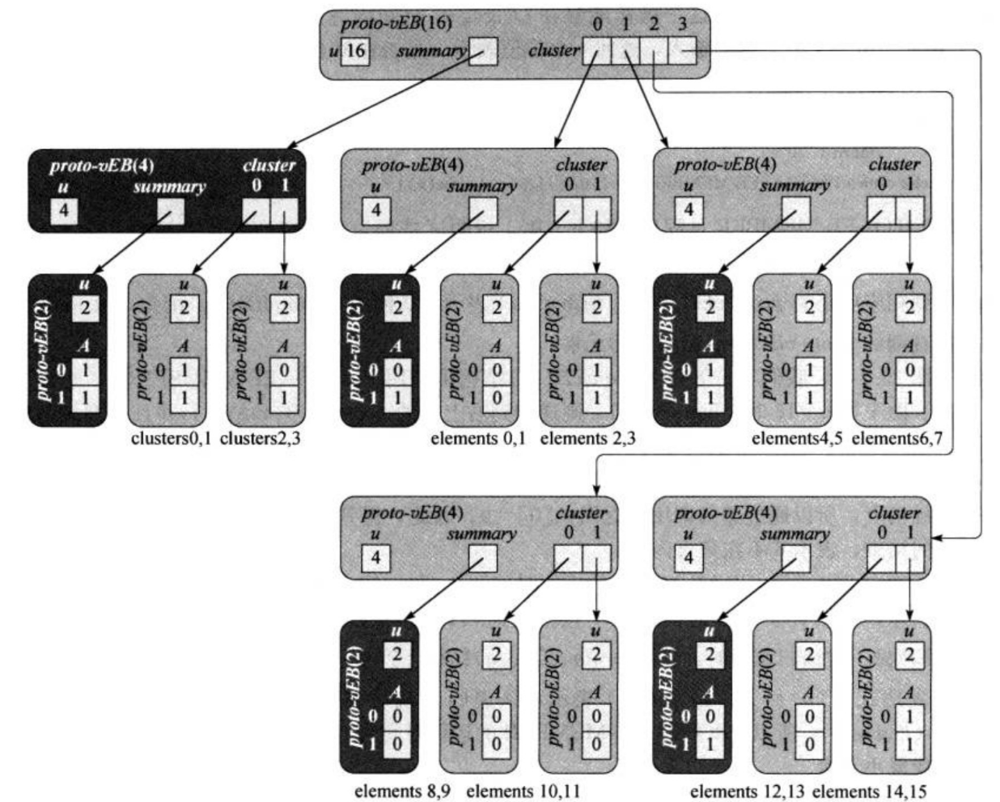
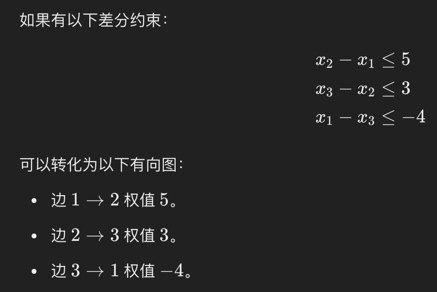

# 算法导论中的伪代码格式和示例
在最开始说明输入和输出
```
Input: A list of n numbers.
Output: A sorted list of the n numbers.
```
```
INSERTION-SORT(A)
1  for j = 2 to A.length
2      key = A[j]
3      i = j - 1
4      while i > 0 and A[i] > key
5          A[i + 1] = A[i]
6          i = i - 1
7      A[i + 1] = key
```
# 循环不变式
证明循环算法正确的一个方法是通过循环不变式。
循环不变式分为初始，保持和终止三个阶段，就像数学归纳法一样。
# 递归式的求解
递归式的求解有三种方法：
递归树法、代入法、主方法
## 递归树法
递归树法是将递归是画成一个递归树，计算每层的时间复杂度，最后用级数求和将所有的项加到一起。

## 代入法
- 假设T(1)的时间复杂度为O(1)，实际上一般的算法最小问题的时间复杂度都是常数，这个可以不证明。
- 假设T(n)=O(f(n))，猜测递归式的时间复杂度。
- 数学归纳法,假设对k < n,有T(k) ≤ c(f(k)),证明T(n) ≤ c(f(n))，证明前一项正确的情况下，后一项是正确的。

- 下面是一个错误的示例，由于倒数第二个式子并不符合数学归纳法的猜测，故推导是错误的。必须显示地推导出假设的复杂度。


## 主方法


# 排序算法和中位数
## 堆排序算法
- 堆维护算法
堆维护算法是将两个堆合并成一个，其中，堆顶元素是不符合要求的，两个子堆是符合要求的堆。这个算法的时间复杂度为O(logn)
- 建堆算法
建堆算法，假设有一个长度为n的数组，那么n/2之后的元素都是叶子结点，不需要遍历和维护，但是之前的元素都是非叶子结点，需要调用堆维护算法进行维护。总共需要调用n/2次堆维护算法，这个算法的一个上界是O(nlogn)。但是对于一个有n个元素的堆，每一层的节点个数为n/2^h,每个节点需要比较的次数为h。求级数之和（直接积分）可得算法复杂度为O(n)。（证明时以层为单位）

## 线性时间排序
- 计数排序
找到输入数据的范围（最大值和最小值）。
创建一个计数数组，用于记录每个值出现的次数。
通过累加计数数组，确定每个元素的最终位置。
根据计数数组，将元素放入正确位置。
- 基数排序
基数排序是对计数排序的一次优化，依次按照被排序数的每一位进行排序。
- 桶排序
桶排序是假定数据的分布是随机的，然后将数据划分到若干个桶内，然后进行排序

# 随机算法的复杂度分析
## 指示器变量
指示器变量的定义如下：
I_A(ω) =
1, 如果 ω ∈ A
0, 如果 ω ∉ A


# 散列表
## 散列表解决冲突的方法
- 线性探查
- 二次探查
- 双重散列

# 二叉搜索树

## 二叉搜索树的插入
二叉搜索树在插入时，直接将元素插入到树的叶子结点上即可。
## 二叉搜索树的删除
- 如果节点是叶子节点，直接删除。
- 如果节点有一个子节点，用这个子节点替换被删除的结点。
- 如果节点有两个子节点，用中序后继或前驱替换，并递归删除替代节点。


# 红黑树
## 红黑树要满足的性质
- 节点是红色或黑色
每个节点要么是红色，要么是黑色。
- 根节点和叶节点是黑色
红黑树的根节点和叶节点始终是黑色的。
- 红色节点的子节点必须是黑色（不允许连续的红色节点）
即红色节点不能有红色的父节点或子节点，称为“红色节点的子节点为黑色”的性质。
- 从任一节点到其所有叶子节点的每条路径上必须包含相同数量的黑色节点
叶子节点（空节点）是隐式的黑色节点。路径上的黑色节点数称为黑高（Black Height）。

## 红黑树的插入操作
红黑树插入的结点是红色结点，并且插入到树的最底层。除非红黑树是空的，这是插入到跟节点，并且插入的是黑色结点。
- case1: 父节点是黑色，那么插入之后整棵树依旧满足红黑树的性质，不需要进行额外的调整。
- case2: 如果父节点是红色，这时需要进行额外的调整（这时祖父结点一定是黑色）。
- - case2.1: 如果叔结点是红色，那么将祖父结点的黑色向下传递，即叔结点和父节点染成黑色，祖父结点染成红色。这时检查祖父结点是否符合要求，如不符合，递归的进行调整。
- - case2.2: 如果叔结点是黑色的，需要进行旋转。旋转分为四种，分别是LL、LR、RL、RR。这几种类别分别对应父节点和插入结点这两个结点相对于祖父结点的位置。对于LR和RL情况，通过旋转父节点和插入结点转换为LL和RR情况（将红色结点旋转到一条线上）。对于RR和LL情况，通过旋转祖父结点和父节点达到调整的目的。这时，新的祖父结点（原父节点）可能依旧不满足红红的限制，但是黑高是相等的，需要继续进行递归调整。

## 红黑树的删除操作
- 如果删除的结点是叶子结点：
若删除的叶子结点是红色，那么不会破坏红黑树的性质，不需要调整。若删除的叶子结点是黑色，会出现双重黑，需要进行调整。
- 如果删除的结点有一个子节点：
若删除的结点是红色，依旧不改变红黑树的性质，不需要进行调整。若删除的结点是黑色结点，则其子节点一定为红色（因为另一边是NIL，黑高为0），这时，只需要将红色结点染色为黑色即可。
- 如果删除的结点有两个子节点：
若后继结点为红色，则其必为叶子结点（若不然，则黑高不相等或红结点相连）。直接用后继结点替换删除结点，然后将后继结点染成原结点相同的颜色即可。
若后继结点为黑色，则会引发双重黑。
## 双重黑的调整（看兄弟的颜色）
双重黑是红黑树黑高不同的情况（双重黑的意思是当前结点需要当作两个黑结点才能使黑高相同）。双重黑是删除一个黑结点导致的，由于删除的结点只可能是叶子结点或者后继结点，那么被删除的结点一定有一个兄弟。  
双重黑的解决思路可以分为两类，一类是让兄弟分支少一个黑结点，将双重黑向上传递。另一类是通过旋转让兄弟分支黑高不变的情况下，双重黑分支多一个黑高。
- 若兄弟结点是红色，则父节点一定是黑色，只需将父节点和兄弟结点的颜色对调，然后旋转父节点和兄弟结点，转到case2
```
    P(黑)
   /   \
 X(双黑) S(红)
       /   \
    SL(黑) SR(黑)

```
- 若兄弟结点是黑色，且兄弟结点的两个字结点都是黑色，只需将兄弟结点染红，这时父节点是双重黑。
```
    P(黑)
   /   \
 X(双黑) S(黑)
       /   \
    SL(黑) SR(黑)
```
- 若兄弟结点是黑色，且近端子节点是黑色，远端子节点是红色，则将远端子节点染成黑色，然后旋转兄弟结点和父节点，调整完毕。
```
    P(黑)
   /   \
 X(双黑) S(黑)
       /   \
    SL(黑) SR(红)

```
- 若兄弟结点是黑色，近端子节点是红色，远端子节点是黑色，则将兄弟结点和近端子节点调换颜色，然后旋转近端子节点和兄弟结点，转为case3
```
    P(黑)
   /   \
 X(双黑) S(黑)
       /   \
    SL(红) SR(黑)

```
# 数据结构的扩张与区间树
数据结构的扩张是指，在普通数据结构的基础上，在每个结点添加一些统计量，使整棵树能具有统计的功能。例如，可以统计子节点的数量，键值和，最大最小值等。

## 区间树
区间树是一种扩张的数据结构，区间树的键值是区间的最小值，区间树使用数据结构扩张的方法存储所有区间的右端点的最大值。
- 插入
- 删除
- 查询

# B树和B+树
## B树
B树是一种平衡的多叉树，B树最多有m个子节点，称为B树的阶。

每个非叶节点最多存储 m−1 个关键字。

每个非叶节点至少存储 ⌈m/2⌉−1 个关键字（根节点除外）

- 查询操作：查询操作的时间复杂度为O(logn)
    
- 插入操作：将需要插入的数据插入到应插入的叶子节点，如果插入之后的节点的关键字数量超过了m-1，则将节点进行分裂，分裂之后，将中间的关键字提升到父节点。
    
- 删除操作：如果目标关键字在叶子节点中，直接删除。如果目标关键字在内部节点中，则用前驱或者后继关键字替代。如果删除导致某个节点的关键字数量少于 ⌈m/2⌉−1，需要从兄弟节点借关键字，或将节点和兄弟节点进行合并


# 动态规划
动态规划是一种表格方法，将子问题的最优解存到表格中，来避免重复的计算。动态规划分为递归的写法（带备忘录的自顶向下方法）和迭代的写法（自底向上方法）。
## 动态规划的设计方法
- 刻画一个最优解的结构特征
- 递归地定义最优解的值
- 计算最优解的值，通常采用自底向上的方法
- 利用计算出的信息构造一个最优解

## 动态规划的性质
- 最优子结构性质：问题的最优解是由子问题的最优解组合而成。（最短路径问题的子问题还是最短路径，是具有最优子结构的。但是最长路径并非如此）
- 子问题是无关且重叠的：重叠的意思是子问题需要多次计算，但是子问题的解之间互不影响。（例如最短路径的子问题是互不影响的，但是最长路径子问题是相互影响的）

- 最优子结构的证明方法：剪切粘贴法。剪切粘贴法就是假定子问题的解不是最优解，将这个子问题的解带入，可以得到一个更优的解。

## 动态规划的子问题图
上文中提到，动态规划是一种表格法，将所有问题的最优解放到表格中。基于此，我们可以将表格转换为一个问题转换图，大问题的解是由小的问题转换而来。因此，可以得出，动态规划的时间复杂度是问题图的结点数和边数。

# 贪心算法
贪心算法是一种特殊的动态规划，能使用贪心算法解决的问题都能使用动态规划解决。
因此，动态规划问题所具有的性质，贪心问题也都具有。
但是，贪心问题与动态规划的区别在于，贪心问题在使用小问题的解推导大问题的解有一个直接而正确的选择。

## 拟阵
拟阵（Matroid）是一种抽象的数学结构，用来统一地研究“独立性”这一概念。在贪心问题中，拟阵用来证明一个问题是否具有最优子结构。
  
一个拟阵由两部分组成：
一个底集E，可以是任意一组对象，比如向量、图的边等。一个由 E 的子集组成的集合 I，这些子集被称为独立集。在贪心问题中，E就是所有最小的子问题的集合，I就是所有由子问题组成的问题。
  
独立集需要满足以下三个条件：
非空性： 最起码，空集（什么都不包含的集合）是独立集。
遗传性： 如果一个集合是独立集，那么从它里面取出一些元素后得到的集合，仍然是独立集。（简单来说，大集合独立，小集合也独立。）
交换性： 如果有两个独立集，其中一个比另一个大（元素更多），那么从大的集合里取一个元素，加到小的集合里，新的集合仍然是独立集。（大的独立集可以“扩展”小的独立集。）


加权和加权胚：我们对E上的每一个元素加上一个权重w，那么这时计算整个胚的权重，得到的就是加权胚。

- 拟阵的胚是拟阵中的最大独立子集

- 在通过拟阵解决一个贪心问题时，可以分为以下步骤：
首先证明该问题是一个贪心问题，即问题符合拟阵的形式
为每个子问题附上一个权重
找到拟阵中的最小加权胚或者最大加权胚


# 摊还分析
- 聚合分析
计算出每个算法产生的时间代价，然后加在一起取平均数。聚合分析在考虑每个算法的时间代价时，不显式地考虑潜在的时间代价。
- 核算法
将复杂的操作分解为核心部分和非核心部分，核心部分单独计算。
- 势能法
势能法是直接将算法以后可能产生的时间代价通过势能的方式考虑进来。
- 以数组的插入和扩容为例
使用聚合算法进行计算，每次计算插入的代价，等到需要扩容，就加上扩容的代价。    
使用核算法进行计算，将数组的扩容定为核算法，计算的时候将数组的核算法时间代价计算出来，剩下的n次操作计算为n。
使用势能法进行计算，每次插入时，都将势能变化计算进去（当前数组元素数量-原数组元素数量），数组的扩容不需要额外考虑。

# 斐波那契堆
斐波那契堆不是一个单一的树，而是一组松散的堆序树（树的根节点比子节点小）。
所有的堆序树的根节点以一个根链表的形式组织起来。所有兄弟结点之间也有链表相连。斐波那契堆还有一个指向最小跟结点的指针。

## 斐波那契堆的时间复杂度


 
1. 插入元素（O(1) 摊还时间）
把新元素作为一个单节点树，直接加到根链表里。
不需要立即整理堆，省时省力。
2. 合并堆（O(1) 摊还时间）
将两个堆的根链表简单地合并到一起。
这是斐波那契堆最大的优点之一，传统堆（如二叉堆）需要复杂的操作来合并。
3. 删除最小值（O(logn) 摊还时间）
找到当前堆中最小的根节点。
将其子节点逐一添加到根链表中。
对根链表进行“整理”，即合并具有相同阶数的树（这里阶是指直接子节点的数目）。
4. 减少键值（O(1) 摊还时间）
如果某个节点的值减少到比父节点还小，就切断该节点及其子树，并把它放到根链表中。
如果某个节点被切断多次，可能触发更高层的切断，直到树满足平衡条件。（如果父节点已经丢失过结点就是mark=true，则将父节点也进行切割）
5. 删除节点（O(logn) 摊还时间）
先用减少键值操作将目标节点减到负无穷（比最小值还小）。
然后执行删除最小值操作。

## 斐波那契堆的势能函数  

我们引入一个势能函数 Φ来衡量斐波那契堆的当前状态复杂度。定义为：
Φ=t+2m
其中：
t 是根链表中的树的数量。
m 是堆中被标记的节点数量。

这样设计的原因可以考虑对于一个结点，将其完全拿出数据结构所需要的操作数量。跟节点弹出数据结构只需要一步操作，但是有标记的结点弹出数据结构需要先移动到跟节点，然后再删除。

# van Emde boas树

vEB树的结构图如上图所示，其中，每个框起来的部分都是一个小的vEB树，也可以将所有的vEB树都理解为结点。
每个vEB树由三个部分组成，
- min 和 max：
存储集合中的最小值和最大值，支持快速查找。
- summary：
一个规模为U的vEB 树，用于记录哪些簇非空。
- cluster：
一个数组，每个元素是一个规模为U的子 vEB 树，分别存储对应簇内的具体数据。

# 基本图算法
## 图的表示
- 邻接矩阵
- 邻接表
## 深度优先搜索


## 广度优先搜索
## 拓扑排序


# 最短路径算法
## dijiestra算法
迪杰斯特拉算法维护一个到源点最短路径的集合，每次迭代选取一个未松弛过的距离最短的点进行松弛操作，然后更新相邻点的最短路径。
```
Dijkstra(graph, source):
    dist[] = [∞] * (number of vertices)
    dist[source] = 0
    priority_queue = [(0, source)]  # (distance, vertex)
    visited = set()

    while priority_queue is not empty:
        (current_dist, u) = priority_queue.pop()  # Get the vertex with the smallest distance
        if u in visited:
            continue
        visited.add(u)

        for (v, weight) in graph[u]:  # For each neighbor of u
            if v not in visited:
                new_dist = current_dist + weight
                if new_dist < dist[v]:
                    dist[v] = new_dist
                    priority_queue.push((new_dist, v))

    return dist

```

## 查分约束转换为最短路径问题

查分约束就是将两个差值看成一条路径。

## bellman-ford算法
迪杰斯特拉算法是一种基于贪心的算法，在每次进行松弛操作时，只选取了最短的路径进行松弛操作。这种贪心算法成立的基础是，路径的权重都是正的，这样当前的最短路径在以后也是最短路径。但是如果存在负权边，当前的最短路径在之后就不一定是最短路径。
在存在负权边的情况下，我们需要对所有的边都进行松弛操作，而不是仅对最短路径进行松弛操作，这就是bellman-ford算法
```
BellmanFord(graph, V, E, source):
    dist = [∞] * V
    dist[source] = 0

    # Step 1: Relax all edges V-1 times
    for i from 1 to V-1:
        for each edge (u, v, weight):
            if dist[u] + weight < dist[v]:
                dist[v] = dist[u] + weight

    # Step 2: Check for negative weight cycles
    for each edge (u, v, weight):
        if dist[u] + weight < dist[v]:
            return "Negative weight cycle detected"

    return dist

```
## floyd算法
```
Floyd-Warshall(graph, n):
    # 初始化距离矩阵
    dist = graph

    for k = 1 to n:                  # 遍历所有中间节点
        for i = 1 to n:              # 遍历所有起点
            for j = 1 to n:          # 遍历所有终点
                dist[i][j] = min(dist[i][j], dist[i][k] + dist[k][j])

    return dist
```

时间复杂度和空间复杂度

O(N^3)

循环kij均不能随意对调

# 网络流
Ford-Fulkerson 方法

不断寻找增广路径并调整流量。
时间复杂度：
O(E∣f∣)（与最大流值∣f∣ 成正比）。
Edmonds-Karp 算法
Ford-Fulkerson 方法的改进，使用广度优先搜索（BFS）找到最短增广路径。
时间复杂度：
O(VE2)（确保多项式时间）。
Dinic 算法
构建层次网络并寻找阻塞流。
时间复杂度：
O(EV)（适用于稠密图）。
预流推进算法
通过“推进”和“重标记”操作优化流量更新。
时间复杂度：
O(V 3)，在稠密图中效率较高。

