# 一、软件工程概述
- 软件的本质: 复杂性、一致性、可变性和不可见性
- 软件生命周期
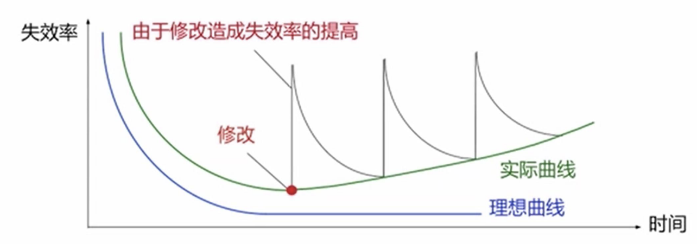
- 软件的分类
应用软件、系统软件、支撑软件
# 二、软件过程
软件过程的含义：按照项目进度、成本和质量要求,遵循用户需求,开发和维护软件、管理  软件项目的一系列有序软件开发活动
## 软件过程模型
- 瀑布模型
瀑布模型是最早的软件开发模型之一，遵循线性和顺序的过程。其开发流程被划分为若干阶段，每个阶段都必须完成后才能进入下一个阶段。典型的阶段包括需求分析、设计、编码、测试和维护。
这种模型的优点是结构清晰，适用于需求明确且变动较少的项目。然而，其缺点在于对需求变更的适应性差，一旦某个阶段完成，回溯和修改会非常困难。
- 增量模型
增量模型是将系统开发分为多个增量，每个增量都是软件的一个部分，逐步添加新的功能模块。每个增量都是一个小版本，在开发过程中可以逐步进行需求分析、设计、实现和测试。
这种方法的优点是每个增量都能早期交付并得到客户反馈，降低了风险。缺点是对整体架构设计的把控较弱，可能导致系统的模块间存在不一致性。
- 迭代模型 
迭代模型是将软件开发过程分为多个小的迭代，每次迭代都包含需求分析、设计、编码和测试等环节。在每次迭代中，软件的功能逐渐增多，并根据用户的反馈进行调整。
与增量模型相似，但迭代模型强调在每次迭代后都需要评审和优化之前的工作。优点是能够灵活应对需求变更，逐步完善系统，缺点是每个迭代周期的结束可能不具备完整的产品。
- 原型模型 
原型模型通过构建初步的原型系统来快速展示功能，用户可以提前体验系统的部分功能，并给出反馈。根据这些反馈，开发团队会对原型进行修改和改进，直到满足用户需求。
优点是能够帮助用户明确需求，减少需求不明确的问题，但缺点是原型可能会影响到最终系统的架构设计，且开发周期不容易控制。
- 螺旋模型 
螺旋模型结合了瀑布模型和原型模型的优点，强调风险评估，并根据每个阶段的反馈来决定是否继续开发。每个螺旋周期都包括规划、风险分析、工程实现和评估四个部分。
其特点是每一轮迭代的目标不仅仅是完成特定功能的开发，还包括对风险的控制。优点是能够灵活应对风险和需求变化，适用于大规模、复杂的项目，但它的缺点是管理和成本较高，需要不断的评审和反馈。
- 基于构件的过程模型 
- UP模型
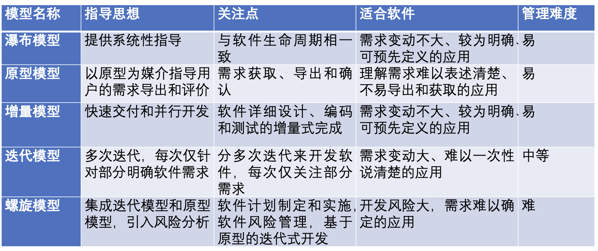
## 敏捷开发
- 敏捷开发宣言的核心价值观
个体与互动胜过流程与工具
工作的软件胜过详尽的文档
客户协作胜过合同谈判
响应变化胜过遵循计划
- 敏捷开发常用框架
- - Scrum
最流行的敏捷框架，强调固定周期的冲刺（Sprint）和团队角色分工（如产品负责人、开发团队、Scrum Master）。
- - 看板（Kanban）
通过可视化工具（如任务板）追踪工作状态，随时调整任务，流动性更强。
- - 极限编程（XP）
强调技术实践，如结对编程、代码重构、测试驱动开发（TDD）。
- - SAFe（Scaled Agile Framework）
适用于大规模企业的敏捷开发方法。
# 三、软件需求分析
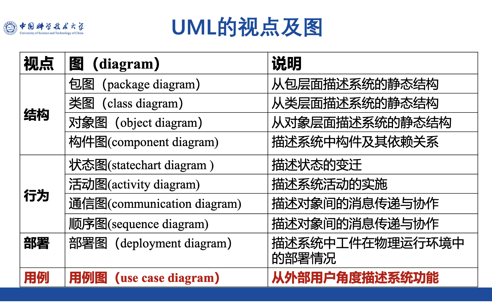
## 顺序图
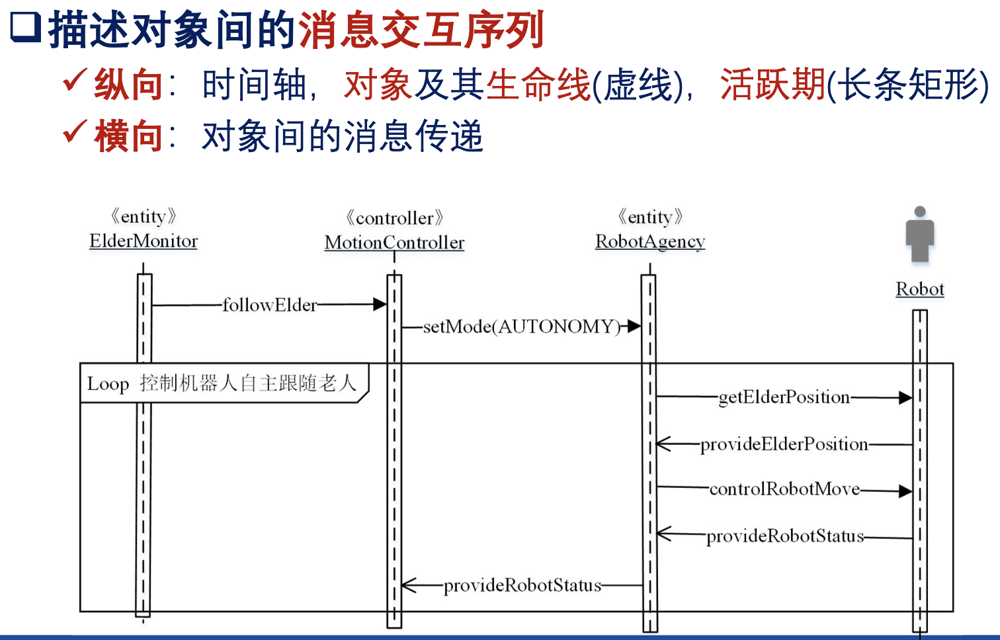
## 通信图
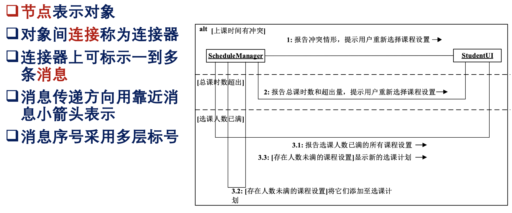
## 类间关系和类图
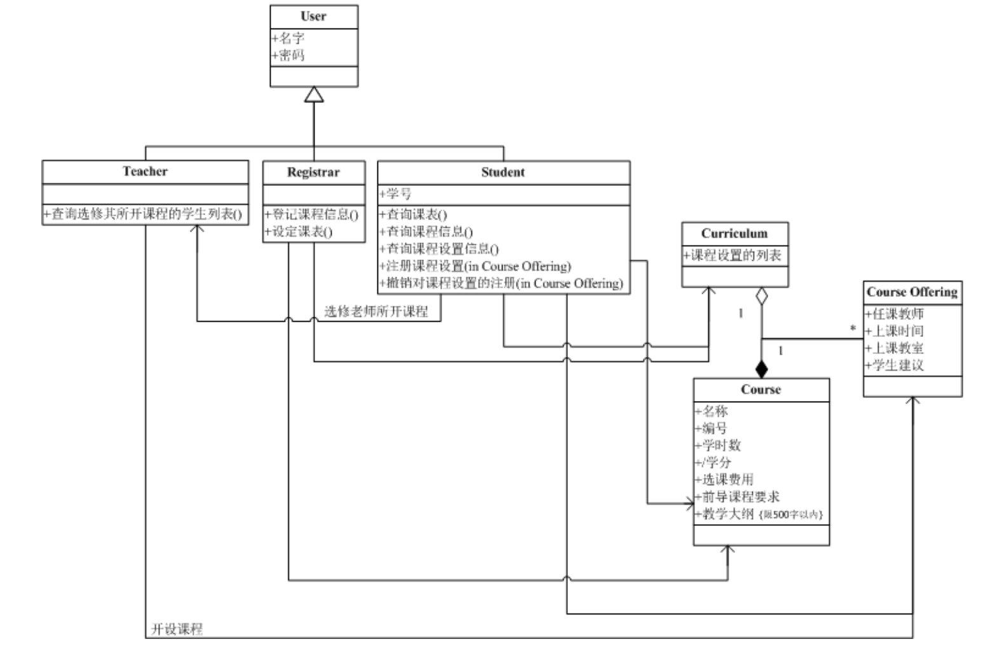
## 状态图
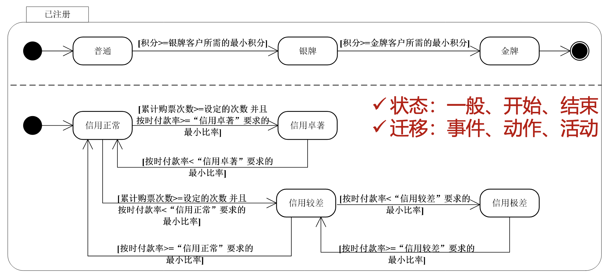
# 四、体系结构设计
软件体系结构：也称软件架构,从高层抽象⻆度刻画组成软件系统的设计元素及它们之间的逻辑关联。
## 1.2 软件体系结构的元素
- 构件(Component)构成体系结构的基本功能部件。可分离、可替换、可复用、可配置
- 连接件(Connector)组件之间的连接和交互关系。
- - 构件的二种接口(Interface)  供给接口:对外提供的接 需求接口:请求其他构件帮助所需的接口
- - 构件的实现与构件的接口相分离
- 约束(Constraint)组件中的元素应满足的条件以及组件经由连接件组装成更大模块时应满足 的条件。
高层次软件元素可向低层次软件元素发请求,低层次软件元素完成 计算后向高层次发送应答,反之不行。每个软件元素根据其职责位于适当的层次,不可错置,如核心层不能包含界面输入接收职责。每个层次都是可替换的,一个层次可以被实现了同样的对外服务接口的层次所替代。

## 1.4 描述软件体系结构的三种UML视图
- 包图：包是一组具有逻辑关联的UML模型元素(例如用例、类等)、模型图 (用例图、类图、交互图、状态图、活动图等),以及其他的包。包在模型管理过程中是配置管理的基本单元,同时也为访问控制提 供基本手段。
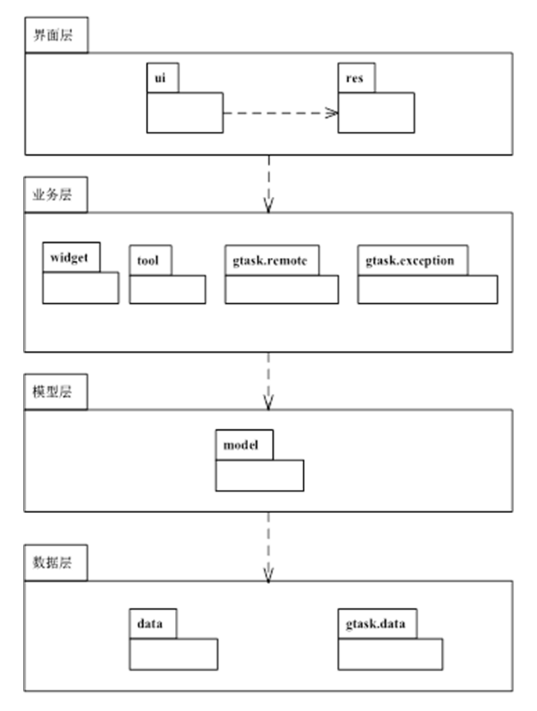
结点：包，连线：包间关系
- 构件图：描述软件系统中构件及构件间的构成和依赖关系
节点:构件,具有对外接口、可分离和独立功能物理模块
边:构件间的依赖关系
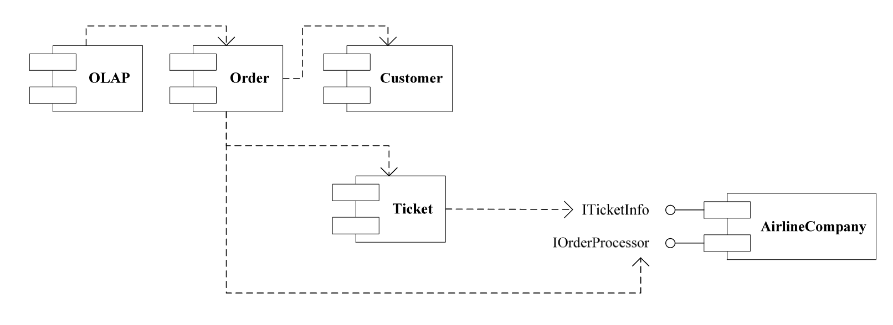
- 部署图：
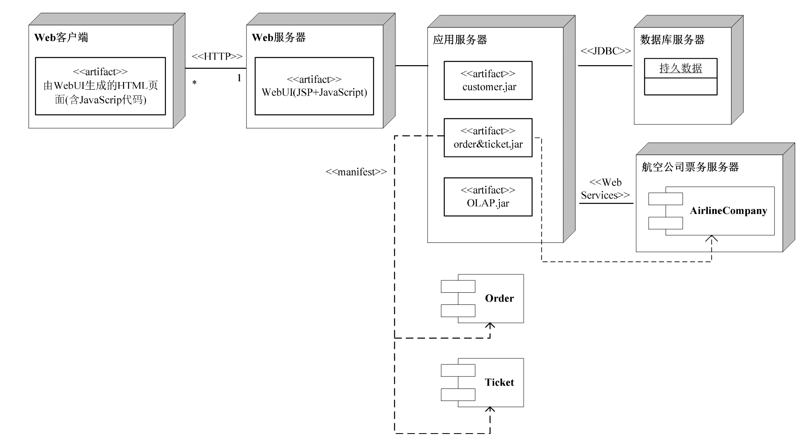

## 软件体系结构的子风格
分层⻛格、管道与过滤器⻛格、黑板⻛格、MVC⻛格、SOA⻛格、总线⻛格、C/S⻛格、B/S⻛格
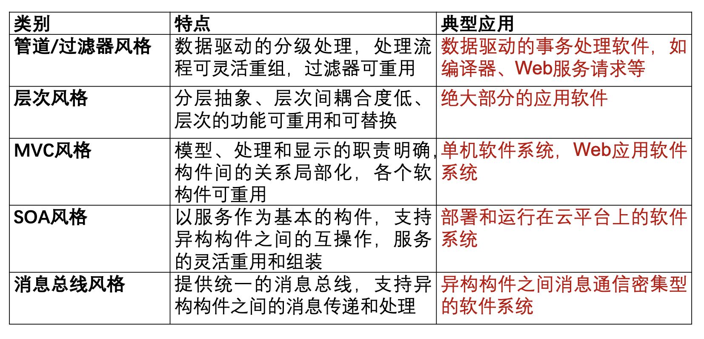
# 五、详细设计
## 1.5软件设计模式
## 活动图
活动图是描述实体为完成某项功能而执行的操作序列,其中某些操作或其子序列存在并发和同步。
活动点:表示计算过程
决策点:根据条件进行活动决策
边:表示控制流或信息流
并发控制
泳道：将活动图用形如游泳池中的泳道分隔成数个活动分区,每个区域由 一个对象或一个控制线程负责。

## 类设计
- 类间关系的语义强度从高到低依次是:继承,组合,聚合,(普通)关联,依赖。
- “自然抽象”原则,类间关系应该自然、直观地反映软件需求及其实现模型。
- “强内聚、松耦合”的原则,即、尽量采用语义连接强度较小的关系

# 六、面向对象的设计模式
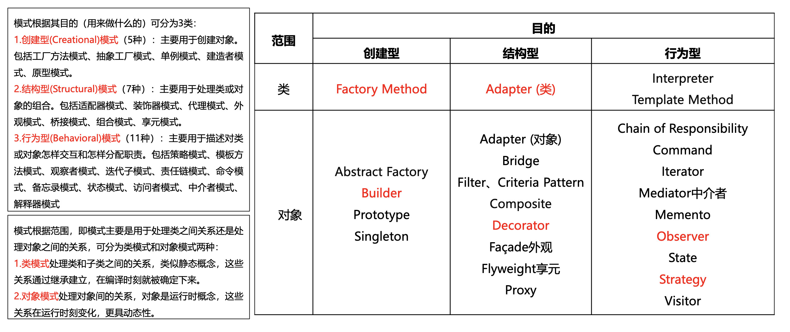
# 八、软件实现基础和编码

# 九、软件测试
- 测试用例包括四个元素：输入数据、前置条件、测试步骤、预期输出。
## 白盒测试
- 语句覆盖法、判定覆盖、条件覆盖、判定/条件覆盖、条件组合覆盖、路径覆盖。
- 语句覆盖法：使得程序中的每一个语句至少被遍历一次。
- 判定覆盖（分支）：使得程序中每一个分支至少被遍历一次。
- 条件覆盖：使得每个判定的条件获取各种可能的结果。
- 判定/条件覆盖：使得判定中的条件取得各种可能的值，并使得每个判定取得各种可能的结果。
- 条件组合覆盖：使得每个判定条件的各种可能组合都至少出现一次。
- 路径覆盖：覆盖程序中所有可能的路径。
## 黑盒测试技术
等价类划分法
边界值划分法
正交数据测试
基于模型的测试
# 十、软件项目管理
- 软件项目管理的对象：人(参与项目 开发的人员)、物(软件制品)、过程(软件开发过程)
- 关键路径是指软件项目进度计划中从起始活动开始到结束  活动为止,具有最长长度的路径。长度是指软件开发时间。